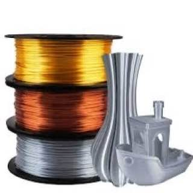
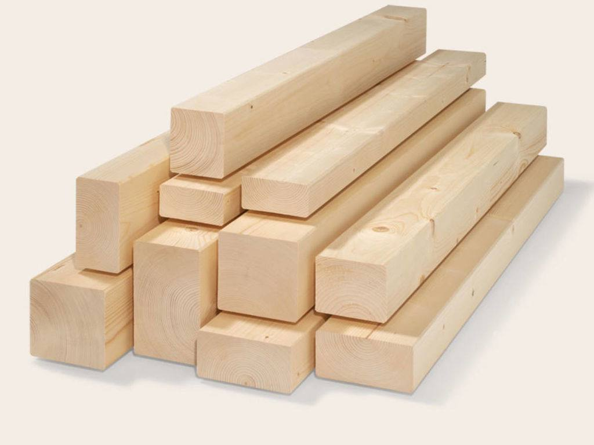
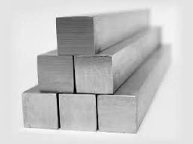
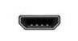
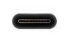
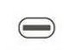

<html>
	<head>
	<title>MAG industries</title>
	<meta name="Glushnev Mikhail Alekseevich">
	<meta countent ="The site of the company MAG industries">
	<meta name="Keyboards" content="sait, MAG industries, interesting, tehnology, content, startup, 3d printer, arduino, code, knowledge, machine, auto, car, arduino, HTML, python, C++, sport">	
	</head>
	
    <body style="background-color:#CCE1FE">
    
<b><a href="https://mag858.github.io/MAG-industries/">вернуться на главную</a>&emsp;</b>

    
    

    
    
    <h2>
<b>future - right now</b>

				
(будующее - прямо сейчас)
</h2>
				
		
<h3>вопросы</h3>

		<form action="https://api.web3forms.com/submit" method="POST">
		<input type="hidden" name="access_key" value="cabd165b-582a-434a-8aec-d05523b4c7f7">
		
		
<input type="text" name="имя: " placeholder="Ваше Имя">
	
	<input type="text" name="Сколько лет: " placeholder="Сколько вам лет" maxlength="3">
	
	
<input type="text " name="email: " placeholder="Ваш email">

	
	<!--начало первого вопроса-->
	
	
<b>1) Какое устройство вы бы хотели преобрести от нас (часы, power bank, 3Д модели и т.п)?</b>

			

			
			<input type="text" name="1. устройство " placeholder="пример: Хочу колонку.">

    
    <!--конец первого вопроса-->
    
    <!--начало второго вопроса-->
    
    
<b>2) Какой материал корпуса вы бы хотели видеть у вашего устройства?</b>

			
			
			
						
			
			
			
			
&emsp;&emsp;Пластик 
			<input type="checkbox" name="2. пластик">
			&emsp;&emsp;&emsp;Дерево 
			<input type="checkbox" name="2. дерево">
			&emsp;&emsp; Металлический 
			<input type="checkbox" name="2. металический">

            
			<input type="text" name="2. вид материала " placeholder="Ваш вид материала.">
    
    <!--конец второго вопроса-->
    
    <!--начало третьего вопроса-->
    
    
<b> 3) Сколько по времени вы бы эксплуатировали устройство? </b>

			

			 
			<input type="text" name="3. лет эксплуатации " placeholder="В годах.">

			
			<!--конец третьего вопроса-->
			
			<!--начало четвертого вопроса-->
			
		
<b>4) Какой разьем для зарядки вам будет удобен?</b>

		
		
		&emsp;&emsp;&emsp;&emsp;&emsp;
		
		&emsp;&emsp;&emsp;
		
		
		
			
&emsp; Micro-usb 
			<input type="checkbox" name="4. разьем micro - usb">
			&emsp;&emsp; Type-C 
			<input type="checkbox" name="4. разьем type-C">
			&emsp;&emsp;Lightning 
			<input type="checkbox" name="4. разьем lightning">

			
			<!--конец четвертого вопроса-->
			
			<!--начало пятого вопроса-->
			
		
<b>5) Какой размер устройства вам будет более удобен в (мм)?</b>

			

			<input type="text" name="5. размер устройства " placeholder="пример: 200/100/30.">
	
			
			<!--конец пятого вопроса-->
			
			<!--начало шестого вопроса-->
			
			
<b>6) Какой функционал вашего устройства вы бы хотели добавить? </b>

			

				
            <textarea name="6. функционал устройства " placeholder="пример: добавте в колонке беспроводную зарядку  "></textarea>
            
            <!--конец шестого вопроса-->
            
            <!--начало седьмого вопроса-->
            
            
<b>7) Какой цвет вашего устройства вы бы хотели? </b>

			

				
            <input type="color" name="7. цвет устройства" placeholder="пример: красный.">
	
            
            <!--конец седьмого вопроса-->
    
  
<input type="submit" value="отправить" class="btn" name="send">
			
			<input type="reset" value="сброс">

			
